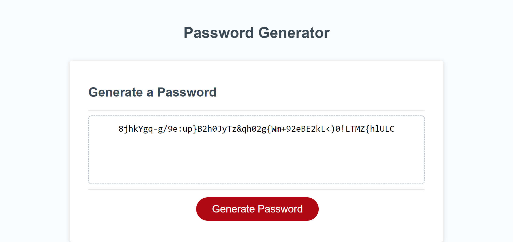

# 03 JavaScript: Password Generator

## Description

For this Password Generator page I wrote Javascript code to create a page that helps User generate unique password according to his choice of using letters, numbers and special characters. I was provided with HTML and CSS files for this challenge.

## Installation

 I had to write my javascript file using knowledge I got during my bootcamp classes.

 ## Acceptance Criteria

GIVEN I need a new, secure password
WHEN I click the button to generate a password
THEN I am presented with a series of prompts for password criteria
WHEN prompted for password criteria
THEN I select which criteria to include in the password
WHEN prompted for the length of the password
THEN I choose a length of at least 8 characters and no more than 128 characters
WHEN asked for character types to include in the password
THEN I confirm whether or not to include lowercase, uppercase, numeric, and/or special characters
WHEN I answer each prompt
THEN my input should be validated and at least one character type should be selected
WHEN all prompts are answered
THEN a password is generated that matches the selected criteria
WHEN the password is generated
THEN the password is either displayed in an alert or written to the page

 ## Usage

This web page shows basic information about HTML, CSS,  and JavaScript and shows how I implemented it into my project

## Credits

N/A

## License

MIT license
